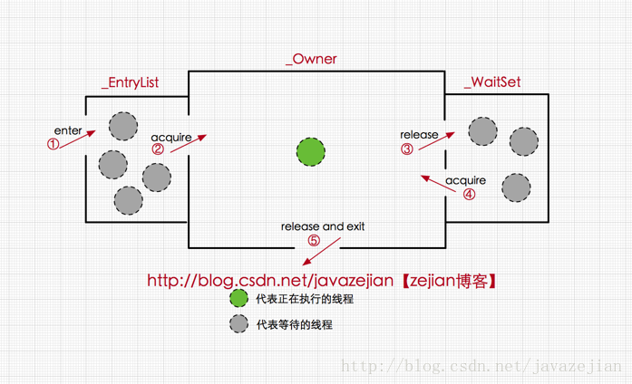
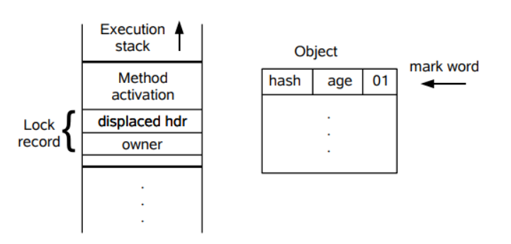
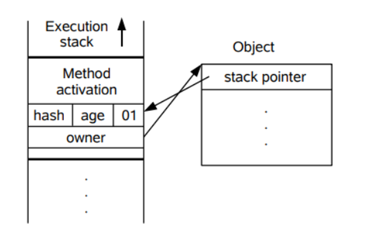
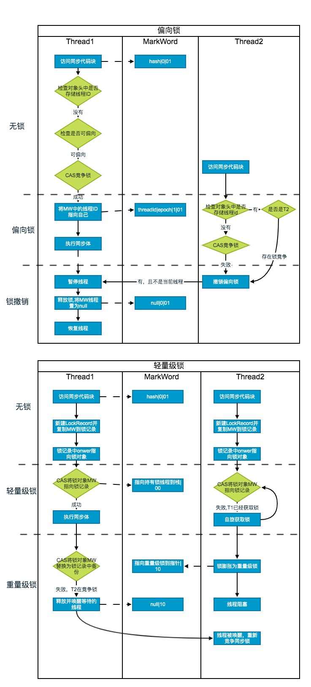

# synchronized

<a name="vBMDQ"></a>
# 实现原理
> synchronized可以保证方法在运行方法或代码块时，同一时刻只有一个线程可以访问到临界区，同时还可以保证共享变量的内存可见性

Java 中每一个对象都可以作为锁<br />1.普通同步方法，锁的是当前实例对象<br />2.同步方法块，锁的是括号里的对象<br />3.静态同步方法，锁的是当前类的class对象

下面来看一段代码<br />

```java
public class SynchronizedTest {
    public int i;
    public synchronized void test1() {
        i++;
    }

    public void test2() {
        synchronized (this) {
            i++;
        }
    }
}
```
使用javap -v SynchronizedTest命令反编译后为(省略部分代码)：<br />

```java
public class com.example.cgm.juc.SynchronizedTest
...
{
  public int i;
    descriptor: I
    flags: (0x0001) ACC_PUBLIC

  public com.example.cgm.juc.SynchronizedTest();
  
  public synchronized void test1();
    descriptor: ()V
    //方法标识ACC_PUBLIC代表public修饰，ACC_SYNCHRONIZED指明该方法为同步方法
    flags: (0x0021) ACC_PUBLIC, ACC_SYNCHRONIZED
    Code:
      stack=3, locals=1, args_size=1
         0: aload_0
         1: dup
         2: getfield      #2                  // Field i:I
         5: iconst_1
         6: iadd
         7: putfield      #2                  // Field i:I
        10: return
      LineNumberTable:
        line 18: 0
        line 19: 10

  public void test2();
    descriptor: ()V
    flags: (0x0001) ACC_PUBLIC
    Code:
      stack=3, locals=3, args_size=1
         0: aload_0
         1: dup
         2: astore_1
         3: monitorenter		//注意此处，进入同步方法
         4: aload_0
         5: dup
         6: getfield      #2                  // Field i:I
         9: iconst_1
        10: iadd
        11: putfield      #2                  // Field i:I
        14: aload_1
        15: monitorexit			//注意此处，退出同步方法
        16: goto          24
        19: astore_2
        20: aload_1
        21: monitorexit			//注意此处，退出同步方法
        22: aload_2
        23: athrow
        24: return
      Exception table:
         from    to  target type
             4    16    19   any
            19    22    19   any
      LineNumberTable:
        line 22: 0
        line 23: 4
        line 24: 14
        line 25: 24
      StackMapTable: number_of_entries = 2
        frame_type = 255 /* full_frame */
          offset_delta = 19
          locals = [ class com/example/cgm/juc/SynchronizedTest, class java/lang/Object ]
          stack = [ class java/lang/Throwable ]
        frame_type = 250 /* chop */
          offset_delta = 4
}
SourceFile: "SynchronizedTest.java"
```
由上面的字节码可以看出，同步方法和同步方法块实现同步的方法是不一样的，<br />同步方法实现同步的方法是使用monitorenter和monitorexit指令，其中monitorenter指令指向同步代码块开始的位置，monitorexit则指向同步代码块结束的位置<br />同步方法是依靠方法修饰符上的ACC_SYNCHRONIZED实现的<br />


---

<a name="BVwyq"></a>
# Java对象头、monitor
java对象头和monitor是实现synchronized的基础，我们首先来分析一下
<a name="n0gjp"></a>
## Java 对象头
synchronized用的锁是存在Java对象头中。Hotspot虚拟机的对象头主要包括两部分，Mark Word(标示字段)、Klass Pointer(类型指针)。Mark Word是存储对象自身的运行时数据，他是实现偏向锁和轻量级锁的关键，<br />

<a name="uDTGM"></a>
### Mark Word
Mark Word用于存储对象自身的运行时数据，如哈希码，GC分代年龄，锁状态标志，线程持有的锁，偏向的线程ID等。Java对象头一般占用两个机器码(在32位虚拟机中，一个机器码是4个字节，也就是32bit)，但是数组类型会占用3个机器码，因为Java虚拟机可以通过Java对象的元数据信息确定Java的大小，但是无法确定数组的大小，所以有一块是记录数组的长度。下面是Java对象头的存储结构(32位虚拟机)<br />


| 25bit | 4bit | 1bit | 2bit |
| --- | --- | --- | --- |
| 对象的hashCode | 对象的分代年龄 | 是否偏向锁 | 锁标志位 |

对象头信息是与对象自身定义的数据无关的额外存储成本，但是考虑到空间效率，Mark Word被设计成非固定的数据结构以便在极小的空间中尽量存储多的数据，它会根据对象的状态复用自己的存储空间<br />


| 锁状态 | 25bit |  | 4bit | 1bit | 2bit |
| --- | --- | --- | --- | --- | --- |
|  |  |  |  | 是否偏向锁 | 锁标志位 |
| 无锁 | 对象hashCode、分代年龄 |  |  |  | 01 |
| 轻量级 | 指向锁记录的指针 |  |  |  | 00 |
| 重量级 | 指向重量级锁(Monitor)起始位置的指针 |  |  |  | 10 |
| GC状态 | 空 |  |  |  | 11 |
| 偏向锁 | 线程ID | Epoch | 对象分代年龄 | 1 | 01 |

<a name="C0I6x"></a>
## Monitor
每一个被锁住的对象都会和一个monitor关联（对象头的MarkWord中的LockWord指向monitor的起始地址），同时monitor中有一个Owner字段存放拥有该锁的线程的唯一标识，表示该锁被这个线程占用<br />每个对象都存在一个monitor与之关联，当monitor被某个线程持有的时候它便处于锁定状态。在Java虚拟机中的monitor是由ObjectMonitor实现的，主要数据结构如下：<br />

```c
ObjectMonitor() {
    _header       = NULL;
    _count        = 0; //记录个数
    _waiters      = 0,
    _recursions   = 0;
    _object       = NULL;
    _owner        = NULL;
    _WaitSet      = NULL; //处于wait状态的线程，会被加入到_WaitSet
    _WaitSetLock  = 0 ;
    _Responsible  = NULL ;
    _succ         = NULL ;
    _cxq          = NULL ;
    FreeNext      = NULL ;
    _EntryList    = NULL ; //处于等待锁block状态的线程，会被加入到该列表
    _SpinFreq     = 0 ;
    _SpinClock    = 0 ;
    OwnerIsThread = 0 ;
  }
```
ObjectMonitor中有两个队列，**_WaitSet**和**_EntryList**，用来保存ObjectWaiter对象列表(每个等待锁的线程会被封装成ObjectWaiter对象)，**_owner**指向持有ObjectMonitor对象的线程。当多个线程同时访问一段代码时，首先会进入**_EntryList**，当线程获取到对象的**monitor**后，进入**_owner**区域，并把**_owner**设置为当前线程，同时**_count**加1，若线程调用wait()方法，则释放当前持有的monitor，**_owner**变量变为null，**_count**减1，同时该线程进入**_WaitSet**，等待被唤醒，若当前线程执行完毕，也将释放**monitor**，并复位变量。<br />

<a name="fK6d3"></a>
# 

---

<a name="lPH7o"></a>
# synchronized底层实现原理
<a name="tWZRp"></a>
## synchronized代码块
由上面的字节码可以看出synchronized代码块是通过monitorenter和monitorexit指令实现的。<br />当执行monitorenter指令时，当前线程将尝试获取object所对应的monitor的持有权，如果该object的monitor的计数器为0，那么线程获取monitor成功，并设置owner为当前线程，计数器为1，获取锁成功。<br />如果当前线程已经获取object的monitor的持有权，那么它可以重入这个monitor，重入时，计数器加1。<br />如果其他线程已经拥有object的monitor的持有权，当前线程将被阻塞，直到其他线程释放monitor，即执行monitorexit指令，执行线程释放monitor，并将owner设为null，计数器置为0，其他线程将有机会竞争monitor。<br />编译器会确保每个monitorenter都有对应的monitorexit指令，不论是正常执行完还是异常情况。编译器会自动产生一个异常处理器，声明为处理所有异常，就是为了在异常情况下，执行monitorexit指令，确保monitor被释放。从字节码中也可以看出多了一个monitorexit。
<a name="Ns9a4"></a>
## 
<a name="fvxxt"></a>
## synchronized方法
方法级是隐式的，即无需monitorenter和monitorexit指令来控制，他是实现在方法调用和返回操作中。<br />JVM通过方法表结构中是否有ACC_SYNCHROIZED访问标示区分一个方法是否是同步方法，当方法调用时，检查访问标示是否被设置，如果被设置，执行线程先持有mointor，然后再执行方法。方法执行完的时候，释放monitor。在方法执行过程中，其他任何线程都无法在持有同一个monitor。如果方法执行异常，则会在异常抛出之时，自动释放monitor。<br />
<br />早期synchronized效率低低原因是，监视器锁是依赖与底层操作系统的Mutex Lock来实现的，而操作系统实现线程切换需要从用户态切换到核心态，这个状态到转换耗时较长。java6以后从jvm层面对synchronized实现了优化，引入了偏向锁和轻量级锁。
<a name="qgDDq"></a>
# 

---

<a name="OlXyn"></a>
# JVM对Synchronized对优化
锁的状态总共有四种，无锁状态、偏向锁、轻量级锁、重量级锁。随着锁的竞争，锁可以从偏向锁升级到轻量级锁，在升级到重量级锁
<a name="mmJVN"></a>
## 偏向锁
偏向锁是java1.6之后加入的新锁，是针对加锁操作的优化，经研究发现，在大多数情况下，锁不仅不存在竞争，而且经常是由同一个线程获取锁，因此为了减少同一线程获取锁的代价而引入了偏向锁。<br />当一个线程持有偏向锁后，如果没有其他线程过来竞争，同一个线程再次进入同步代码块时，不需要再进行加锁，解锁操作。
<a name="IV5G6"></a>
### 执行过程

1. 判断当前线程id和MarkWord中的线程id是否一致
1. 如果一致，说明已经获取到锁，则继续执行同步代码块
1. 如果不一致，则判断是否可偏向，即偏向标志位的值
1. 如果还未偏向，CAS竞争锁，竞争成功，将MarkWord中线程id设为当前线程id，偏向标志位设为1
1. 如果已偏向，且线程不是当前线程，说明存在竞争，大多情况下就需要升级为轻量级锁


<br />MarkWord：

| bit fields |   | 是否偏向锁 | 锁标志位 |
| --- | --- | --- | --- |
| threadId | epoch | 1 | 01 |


<a name="7DelI"></a>
#### 锁膨胀
可以看出偏向锁是针对一个线程而言的，线程获取锁后，就不会有解锁操作，这样可以节省很大的开销。但是如果存在两个线程来竞争该锁，那么偏向锁就失效了，会膨胀升级为轻量级锁
<a name="kX4Ah"></a>
#### 锁撤销
由于偏向锁失效了，就需要把它撤销

1. 在一个安全点暂停拥有锁的线程
1. 遍历线程栈，如果存在锁记录，则修复锁记录和MarkWord，置为无锁状态
1. 唤醒当前线程，当前锁升级为轻量级锁
> 偏向锁的撤销，需要等待全局安全点（在这个时间点上没有字节码正在执行），它会首先暂停拥有偏向锁的线程，然后检查持有偏向锁的线程是否活着，如果线程不处于活动状态，则将对象头设置成无锁状态，然后重新偏向新的线程；如果线程仍然活着，拥有偏向锁的栈会被执行，遍历偏向对象的锁记录，栈中的锁记录和对象头的
> Mark Word，> 检查该对象的使用情况，如果仍然需要持有偏向锁，则偏向锁升级为轻量级锁，（> **偏向锁就是这个时候升级为轻量级锁的**> ）。如果不存在使用了，则可以将对象回复成无锁状态，然后重新偏向> 


> **安全点:****这个时间点是上没有正在执行的代码**


- 开启偏向锁：-XX:+UseBiasedLocking -XX:BiasedLockingStartupDelay=0
- 关闭偏向锁：-XX:-UseBiasedLocking
<a name="ZtNWm"></a>
## 轻量级锁
<a name="VYhhd"></a>
### 获取锁
在锁撤销升级为轻量级锁后，对象的MarkWord也会进行响应的变化

1. 首先检查当前对象是否是无锁状态
1. 然后在当前线程的栈桢中新建一块锁记录(LockRecord)的空间
1. 把锁对象的对象头中的MarkWord复制到锁记录中，记做DisplacedMarkWord
1. 把DisplacedMarkWord中的onwer指针指向锁对象
1. CAS将锁对象对象头的MarkWord更新为指向锁记录的指针，锁标志位设为00
1. 如果CAS失败，说明有竞争，**等待轻量级锁的线程会进行自旋**


<br />MarkWord：

| bit fields | 锁标志位 |
| --- | --- |
| 指向LockRecord的指针 | 00 |


<a name="sNOUj"></a>
### 
<a name="EpGGs"></a>
### 
<a name="6zBU9"></a>
### 释放锁
释放锁也是提通过CAS实现的

1. 取出存在当前线程栈桢中的DisplaceMarkWord
1. CAS把锁对象的对象头的MarkWord更新为DisplaceMarkWord，如果成功，释放成功
1. 如果CAS失败，说明还有其他线程竞争锁，则需要在释放锁(cas step2)的同时唤醒被挂起的线程

**
<a name="Qg793"></a>
## 自旋锁
轻量级锁获取失败后，线程不会立刻进行操作系统层面的挂起，而是会让线程做几个空循环，如果获取到锁，则执行同步代码块，如果还是获取不到，则进行操作系统层面的挂起，升级到重量级锁<br />自旋锁虽然可以避免线程切换带来到开销，但是自旋占用了处理器时间，如果持有锁的线程不会很快释放锁，那么自旋只会白白浪费资源，所以引入了适应性自旋锁<br />
<br />JDK1.6中-XX:+UseSpinning开启； <br />JDK1.7后，去掉此参数，由jvm控制；
<a name="gu2EN"></a>
## 适应自旋锁
自旋次数根据上次在同一个锁上的自旋时间及锁拥有者的态度决定的。如果自旋成功了，下次自旋次数会增加，因为虚拟机认为上次成功了，这次也很有可能成功。如果自旋失败了，那么下次会减少自旋次数，甚至不进行自旋<br />
<br />
<br />

<a name="SGYwG"></a>
## 如何膨胀
1.当一个线程（假设叫A线程）想要获得锁时，首先检查对象头中的锁标志，如果是偏向锁，则跳转到2，如果是无锁状态，则跳转到3.<br />
<br />2.检查对象头中的偏向线程id是否指向A线程，是，则直接执行同步代码块，不是则3.<br />
<br />3.**使用cas操作将替换对象头中的偏向线程id**，成功，则直接执行同步代码块。失败则说明其他的线程（假设叫B线程）已经拥有偏向锁了，那么进行偏向锁的撤销（因为这里有竞争了），此时执行4.<br />
<br />4.B线程运行到全局安全点后，暂停该线程，检查它的状态，如果处于不活动或者已经退出同步代码块则原持有偏向锁的线程释放锁(标志位01)，然后A再次执行3(**重新偏向新的线程**)。如果仍处于活动状态，则需要升级为轻量级锁(标志位00)，此时执行5.<br />
<br />5.**在B线程的栈中分配锁记录，拷贝对象头中的MarkWord到锁记录中，然后将MarkWord改为指向B线程，同时将对象头中的锁标志信息改为轻量级锁的00，然后唤醒B线程**，也就是从安全点处继续执行。<br />
<br />6.由于锁升级为轻量级锁，**A线程也进行相同的操作**，即，在A线程的栈中分配锁记录，拷贝对象头中的Mark Word到锁记录中，然后使用cas操作替换MarkWord，因为此时B线程拥有锁，因此，**A线程自旋**。如果自旋一定次数内成功获得锁，那么A线程获得轻量级锁，执行同步代码块。若自旋一定次数后仍未获得锁，A升级为重量级锁，将对象头中的锁标志信息改为重量级的10，同时阻塞，此时请看7.<br />
<br />7.B线程在释放锁的时候，**使用cas将锁记录中Displaced Mark Word替换调MarkWord中的信息**，成功，则表示无竞争（这个时候还是轻量级锁，A线程可能正在自旋中）直接释放。失败（因为这个时候锁已经膨胀），那么**释放同时唤醒被挂起的线程**（在这个例子中，也就是A）。<br />
<br />

---

<a name="57nXj"></a>
> 引用
>
> [深入分析synchronized的实现原理](http://cmsblogs.com/?p=2071)<br />[深入理解Java并发之synchronized实现原理](https://blog.csdn.net/javazejian/article/details/72828483)<br />[彻底搞懂synchronized(从偏向锁到重量级锁)](https://www.cnblogs.com/kubidemanong/p/9520071.html)

[下一篇：04-volatile.md](04-volatile.md)