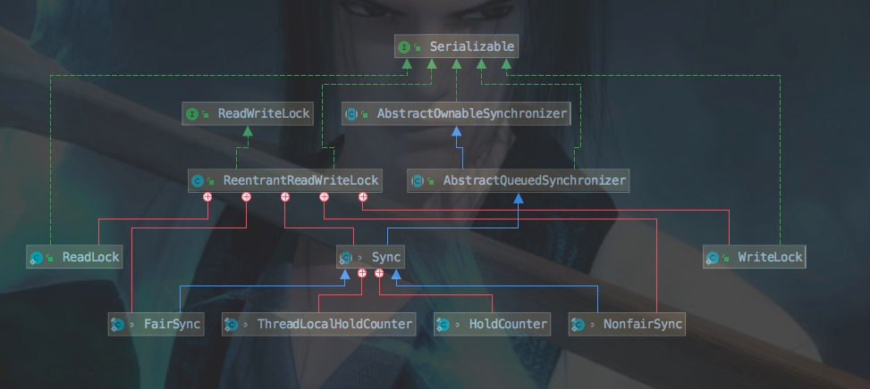

# ReentrantReadWriteLock-读写锁

<a name="PyJqq"></a>
# 概述
ReentrantReadWriteLock内部维护了一对相关的锁：**共享锁**(readLock)、**独占锁**(writeLock)。readLock用于读操作，可以被多个线程同时获取；writeLock用于写操作，只能被一个线程持有。通过读写分离，可以较大提高并发量，在同一时间可以允许多个读线程访问；但是在写入线程访问时，其他读线程和写线程都会被阻塞。读写锁有如下特性：

- 公平性：支持公平锁与非公平锁(默认)
- 重入性：支持重入最多2的16次方-1个写锁和读锁的重入
- 锁降级：遵循获取写锁、获取读锁，释放写锁的次序，写锁会降级为读锁


<a name="OViIS"></a>
# 数据结构和方法
<br />查看UML类图可知，

1. ** ReentrantReadWriteLock**实现类**ReadWriteLock**接口。**ReadWriteLock**是一个读写锁接口，提供了获取读锁**readLock()**和获取写锁**writeLock()**接口
1. **ReentrantReadWriteLock**内部有5个内部类：自定义同步器**Sync**，读锁**ReadLock**和写锁**WriteLock，**公平锁FairSync和非公平锁NofairSync；Sync继承自AQS，并有内部类HoldCounter和ThreadLocalHoldCounter来记录线程重入次数；ReadLock和WriteLock都实现Lock，内部持有Sync对象。所以都同步功能都是在Sync中实现，


<br />
<br />Sync方法如下

```java
abstract static class Sync extends AbstractQueuedSynchronizer {
    private static final long serialVersionUID = 6317671515068378041L;
    // 最多支持65535(1<<16 -1)个写锁和65535个读锁；低16位表示写锁计数，高16位表示持有读锁的线程数
    static final int SHARED_SHIFT   = 16;
    // 读锁高16位，读锁个数加1，其实是状态值加 2^16
    static final int SHARED_UNIT    = (1 << SHARED_SHIFT);
    // 锁最大数量
    static final int MAX_COUNT      = (1 << SHARED_SHIFT) - 1;
    // 写锁掩码，用于标记低16位
    static final int EXCLUSIVE_MASK = (1 << SHARED_SHIFT) - 1;
    //读锁计数，当前持有读锁的线程数，c的高16位
    static int sharedCount(int c)    { return c >>> SHARED_SHIFT; }
    //写锁的计数，也就是它的重入次数,c的低16位
    static int exclusiveCount(int c) { return c & EXCLUSIVE_MASK; }
    //当前线程持有的读锁重入数量
    private transient ThreadLocalHoldCounter readHolds;
    //最近一个获取读锁成功的线程计数器
    private transient HoldCounter cachedHoldCounter;
    // 第一个获取读锁的线程
    private transient Thread firstReader = null;
    //firstReader的持有数
    private transient int firstReaderHoldCount;
    // 构造函数
    Sync() {
        readHolds = new ThreadLocalHoldCounter();
        setState(getState()); // ensures visibility of readHolds
    }
    // 持有读锁的线程计数器
    static final class HoldCounter {
        int count = 0; //持有数
        // Use id, not reference, to avoid garbage retention
        final long tid = getThreadId(Thread.currentThread());
    }
    // 本地线程计数器
    static final class ThreadLocalHoldCounter
            extends ThreadLocal<HoldCounter> {
        // 重写初始化方法，在没有进行set的情况下，获取的都是该HoldCounter值
        public HoldCounter initialValue() {
            return new HoldCounter();
        }
    }
}
```

- Sync内部采用status的高16位为读锁的状态值，低16位位写锁的状态值，读锁每次重入会增加SHARED_UNIT；写锁每次重入会增加1
<a name="4dDGi"></a>
# 源码分析
<a name="txpx0"></a>
## WriteLock
<a name="YZpjX"></a>
### lock()
```java
public void lock() {
   sync.acquire(1);
}
```
lock方法调用来Sync的acquire方法，也就是AQS中acquire方法，之前分析过，acquire方法会调用tryAcquire方法获取锁，tryAcquire方法是由自定义同步器Sync实现
```java
protected final boolean tryAcquire(int acquires) {
    // 获取当前线程
    Thread current = Thread.currentThread();
    // 获取当前同步状态值
    int c = getState();
    // 获取写锁数
    int w = exclusiveCount(c);
    // 已有线程获取锁
    if (c != 0) {
        // c != 0 and w == 0 表示存在读锁，则不允许在获取写锁
        if (w == 0 || current != getExclusiveOwnerThread())
        		// 存在读锁 || 当前线程不是锁持有者
            return false;
        if (w + exclusiveCount(acquires) > MAX_COUNT)
        		// 超出最大范围
            throw new Error("Maximum lock count exceeded");
        // 重入获取锁
        setState(c + acquires);
        return true;
    }
    /** writerShouldBlock 判断写锁释放需要阻塞
     *  非公平锁：返回fals
     *  公平锁：调用AQS.hasQueuedPredecessors判断使用有线程比当前线程等待的久
     */
    if (writerShouldBlock() ||
        !compareAndSetState(c, c + acquires))
        return false;
    // 设置当前线程为锁持有者
    setExclusiveOwnerThread(current);
    return true;
}
```
ReentrantReadWriteLock的tryAcquire方法与reentranLock中的tryAcquire方法基本一致，增加了是否有读锁的判断。因为要确保写线程的操作对读线程是可见的，如果存在读锁的情况下获取了写锁，那么那些获取了读锁的线程就无法感知写线程的操作了，所以需要等读锁释放后写锁才能够获取，一旦写锁获取成功，其他的所有读、写线程都会被阻塞。
<a name="B9H3X"></a>
### unLock()
```java
// ReadLock
public void unlock() {
    sync.release(1);
}

//Sync
protected final boolean tryRelease(int releases) {
    // 当前线程释放是锁持有者
    if (!isHeldExclusively())
        throw new IllegalMonitorStateException();
    // 同步状态值减去释放的资源
    int nextc = getState() - releases;
    boolean free = exclusiveCount(nextc) == 0;
    if (free)
        // 完全释放，设置线程持有者为null
        setExclusiveOwnerThread(null);
    // 设置同步状态值
    setState(nextc);
    return free;
}
```


<a name="WS6FZ"></a>
## ReadLock
<a name="UHq7X"></a>
### lock()
```java
//ReadLock
public void lock() {
    sync.acquireShared(1);
}
// Sync
protected final int tryAcquireShared(int unused) {
    // 获取当前线程
    Thread current = Thread.currentThread();
    int c = getState();
    // 获取写锁数
    // 存在写锁，并且持有者不是当前线程，返回-1
    if (exclusiveCount(c) != 0 &&
        getExclusiveOwnerThread() != current)
        return -1;
    // 获取读锁数
    int r = sharedCount(c);
    /* 1.判断读是否需要阻塞
     * 公平锁：调用AQS.hasQueuedPredecessors判断使用有线程比当前线程等待的久
     * 非公平锁：判断同步队列中头节点的next是否是独占模式(写锁)，如果是，则阻塞，避免写线程一直获取不到锁
     * 2.判断获取锁个数是否超过最大值
     * 3.CAS设置同步状态
     */
    if (!readerShouldBlock() &&
        r < MAX_COUNT &&
        compareAndSetState(c, c + SHARED_UNIT)) {
        if (r == 0) {
            // 首次获取读锁，初始化firstReader和firstReaderHoldCount
            firstReader = current;
            firstReaderHoldCount = 1;
        } else if (firstReader == current) {
            // 当前线程是首个获取读锁的线程，计数直接增加
            firstReaderHoldCount++;
        } else {
            // 获取最近获取读锁的缓存记录
            HoldCounter rh = cachedHoldCounter;
            if (rh == null || rh.tid != getThreadId(current))
                // 更新缓存的holdCounter
                cachedHoldCounter = rh = readHolds.get();
            else if (rh.count == 0)
                readHolds.set(rh);
            // 获取读锁的次数加1
            rh.count++;
        }
        return 1;
    }
    return fullTryAcquireShared(current);
}
```

- 首先会判断写锁是否被持有，如果写锁持有者不是当前线程，则返回-1；否则是可以继续获取读锁(锁降级)
- 如果读锁不需要阻塞，并且读锁个数是不超过最大值，则CAS设置同步 状态

**firstReader、firstReaderHoldCount、cachedHoldCounter、readHolds**

- 同步状态设置完成后，会对这四个变量进行操作，我们先来讲一下这四个变量是干什么的
```java
static final class HoldCounter {
    int count = 0;
    // Use id, not reference, to avoid garbage retention
    final long tid = getThreadId(Thread.currentThread());
}

static final class ThreadLocalHoldCounter
    extends ThreadLocal<HoldCounter> {
    public HoldCounter initialValue() {
        return new HoldCounter();
    }
}

private transient ThreadLocalHoldCounter readHolds;
private transient HoldCounter cachedHoldCounter;
```
**cachedHoldCounter**是HoldCounter类型的变量，**readHolds**是HoldCounter类型的线程本地变量，我们来看一下HoldCounter的代码<br />HoldCounter内部有两个变量，count代表当前线程获取读锁的次数，tid代表当前线程的线程id，<br />通过ThreadLocalHoldCounter把HoldCounter和线程绑定，HoldCounter就是绑定了线程的一个计数器。<br />为什么使用线程id，而没有使用直接记录线程？**是为了避免HoldCounter和ThreadLocal互相绑定而GC难以释放它们**<br />

- **firstReader：**是记录第一个获取读锁的线程
- **firstReaderHoldCount：**是记录**firstReade**线程获取读锁的次数
- **cachedHoldCounter：**记录的是最近一次获取读锁的线程计数，避免频繁的ThreadLocal.get()，提高性能
- **readHolds：**是个线程本地变量，记录着每个线程的线程计数

<br />
<br />我们接着返回lock方法，如果读线程需要阻塞或者获取线程数超过最大值或者CAS设置同步状态失败，则会调用fullTryAcquireShared方法，<br />`fullTryAcquireShared`是获取读锁的完整版本，用于处理CAS失败、阻塞等待和重入读问题。相对于`tryAcquireShared`来说，执行流程上都差不多，不同的是，它增加了重试机制和对“持有读锁数的延迟读取”的处理。<br />

```java
final int fullTryAcquireShared(Thread current) {
    HoldCounter rh = null;
    for (;;) {// 自旋
        int c = getState();
        // 持有写锁的线程可以获取读锁，但是如果持有者不是当前线程，返回-1
        if (exclusiveCount(c) != 0) {
            if (getExclusiveOwnerThread() != current)
                return -1;
            // else we hold the exclusive lock; blocking here
            // would cause deadlock.
        } else if (readerShouldBlock()) {//是否需要阻塞
            // 如果当前线程是第一个获取读锁的线程，继续往下执行
            if (firstReader == current) {
                // assert firstReaderHoldCount > 0;
            } else {
                if (rh == null) {
                    rh = cachedHoldCounter;
                    if (rh == null || rh.tid != getThreadId(current)) {
                        rh = readHolds.get();
                        // 如果当前线程没有获取过读锁，则从本地变量移除
                        if (rh.count == 0)
                            readHolds.remove();
                    }
                }
                // 如果当前线程没有获取过读锁，则返回-1，获取锁失败(让步给等待更久的写线程)
                // 接下来执行AQS.doAcquireShared自旋获取锁或者挂起当前线程
                if (rh.count == 0)
                    return -1;
            }
        }
        if (sharedCount(c) == MAX_COUNT)//读锁获取数量等于最大值，抛出异常
            throw new Error("Maximum lock count exceeded");
        if (compareAndSetState(c, c + SHARED_UNIT)) {// CAS设置同步状态
            // 与tryAcquireShared中一样，增加线程计数
            if (sharedCount(c) == 0) {
                firstReader = current;
                firstReaderHoldCount = 1;
            } else if (firstReader == current) {
                firstReaderHoldCount++;
            } else {
                if (rh == null)
                    rh = cachedHoldCounter;
                if (rh == null || rh.tid != getThreadId(current))
                    rh = readHolds.get();
                else if (rh.count == 0)
                    readHolds.set(rh);
                rh.count++;
                cachedHoldCounter = rh; // cache for release
            }
            return 1;
        }
    }
}
```


<a name="SPy0m"></a>
### unLock()


```java
//ReadLock
public void unlock() {
    sync.releaseShared(1);
}
//Sync
protected final boolean tryReleaseShared(int unused) {
    // 获取当前锁
    Thread current = Thread.currentThread();
    if (firstReader == current) {//判断当前线程是否是首个获取读锁的线程
        // 仅获取了1次设置firstReader 为 null ，否则firstReaderHoldCount-1
        if (firstReaderHoldCount == 1)
            firstReader = null;
        else
            firstReaderHoldCount--;
    } else {
        // 获取当前线程的本地计数，然后更新本地变量中获取锁的信息
        HoldCounter rh = cachedHoldCounter;
        if (rh == null || rh.tid != getThreadId(current))
            rh = readHolds.get();
        int count = rh.count;
        if (count <= 1) {
            readHolds.remove();
            if (count <= 0)
                throw unmatchedUnlockException();
        }
        --rh.count;
    }
    for (;;) {// 自旋更新同步状态
        int c = getState();
        int nextc = c - SHARED_UNIT;
        if (compareAndSetState(c, nextc))
            // Releasing the read lock has no effect on readers,
            // but it may allow waiting writers to proceed if
            // both read and write locks are now free.
            return nextc == 0;
    }
}
```


> 引用：
>
> [https://www.jianshu.com/p/5aec3c3f8585](https://www.jianshu.com/p/5aec3c3f8585)
> [http://cmsblogs.com/?p=2213](http://cmsblogs.com/?p=2213)

[下一篇]()