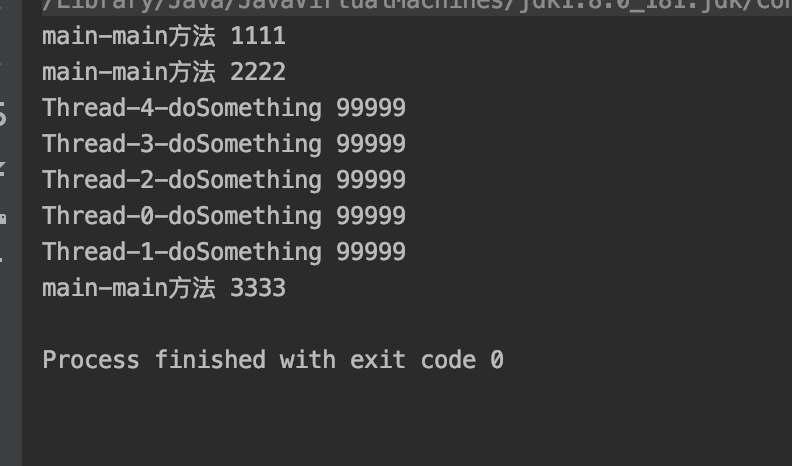

# CountDownLatch

<a name="DJzA5"></a>
# 概述
CountDownLatch是一个同步辅助类，通过AQS来实现的一个闭锁。该类是为了解决某些操作只能在一组操作完成之后才能执行的场景。<br />CountDownLatch初始化时会给定一个计数，一些线程调用countDown()方法，计数会减少，在计数到0之前，调用await的线程都会阻塞；当计数为0，调用await的线程会恢复运行，继续执行await后面的逻辑。这种现象只能出现一次，计数无法重置，就是减到0之后就不能恢复了。

<a name="94Kjw"></a>
# 数据结构与方法
CountDownLatch主要是通过AQS实现，核心属性只有一个Sync，它继承自AQS，重写tryAcquireShared和treReleaseShared方法，以完成共享锁的获取和释放
```java
private static final class Sync extends AbstractQueuedSynchronizer {
    private static final long serialVersionUID = 4982264981922014374L;

    Sync(int count) {
        setState(count);
    }

    int getCount() {
        return getState();
    }

    protected int tryAcquireShared(int acquires) {
        return (getState() == 0) ? 1 : -1;
    }

    protected boolean tryReleaseShared(int releases) {
        // Decrement count; signal when transition to zero
        for (;;) {
            int c = getState();
            if (c == 0)
                return false;
            int nextc = c-1;
            if (compareAndSetState(c, nextc))
                return nextc == 0;
        }
    }
}
```
<a name="Ma8Hj"></a>
## 构造函数
```java
public CountDownLatch(int count) {
    if (count < 0) throw new IllegalArgumentException("count < 0");
    this.sync = new Sync(count);
}
```
构造函数比较简单，传入一个不小于0的计数，然后调用的Sync的构造函数，有上面Sync的构造函数可知，这个count就是AQS 的state的初始值
<a name="CWH9l"></a>
## 核心方法
CountdownLatch主要的方法就两个，一个是countDown，调用一次，就会将当前count减一，当count为0时，就会唤醒所有等待的线程；另一个是await方法，他有两种形式，一种是阻塞式，一种是带超时机制的等待，该方法会将当前等待门闩的线程挂起，直到count为0，有些类似条件队列，相当于等待的条件是count为0， **然而底层实现并不是条件队列，而是共享锁。** 
<a name="ZlOLV"></a>
# 源码分析
<a name="JSndp"></a>
## countDown()
```java
public void countDown() {
    sync.releaseShared(1);
}

protected boolean tryReleaseShared(int releases) {
    // Decrement count; signal when transition to zero
    for (;;) {
        int c = getState();
        // state 已经为0，返回false，不会唤醒等待线程
        if (c == 0)
            return false;
        int nextc = c-1;
        // CAS设置state
        if (compareAndSetState(c, nextc))
            // 返回设置后的state是否为0
            return nextc == 0;
    }
}
```
countDown的目的是将count减一，内部实现就是调用AQS的releaseShared方法释放共享锁，在Sync中实现具体的释放逻辑tryReleaseShared。<br />tryReleaseShared

- 先获取当前state的值
- 如果state已经为0，返回false（此时不会唤醒等待的线程）
- state减一，并CAS设置，如果存在并发导致CAS失败，则会自旋重试
- 然后返回设置后的state->nextc==0

该方法只有一种情况会返回true，就是state从大于0变成0时，也就是所有的门闩任务完成时，然后AQS会唤醒同步队列中所有等待的线程。如果已经返回过true 了，再次调用，也是不会再重复唤醒线程的（此时同步队列中线程已全部被唤醒）
<a name="8H84g"></a>
## await()
```java
public void await() throws InterruptedException {
    sync.acquireSharedInterruptibly(1);
}

protected int tryAcquireShared(int acquires) {
    return (getState() == 0) ? 1 : -1;
}
```
与Condtion的await语义相同，该方法是阻塞式等待，响应中断，只不过在等待的不是signal操作，而是在等待count=0。<br />await方法调用AQS的acquireSharedInterrupibly方法，相应中断的获取锁。Sync中实现AQS中的tryAcquireShared方法实现获取锁操作。tryAcquireShared方法没有抢锁操作，只是判断state是否等于0，等于0就返回1，获取锁成功；不等于0就返回-1，获取锁失败，线程会阻塞。<br />

<a name="zQFOk"></a>
# 示例
```java
package com.java.study.studycode.dome;

import java.util.concurrent.CountDownLatch;

/**
 * @Author:wb-cgm503374
 * @Description
 * @Date:Created in 2020/6/14 8:49 下午
 */

public class CountDownLatchDemo {
    public static void main(String[] args) throws InterruptedException {
        CountDownLatch startLatch = new CountDownLatch(1);
        CountDownLatch doneLatch = new CountDownLatch(5);

        for (int i = 0; i < 5; i++) {
            new Thread(new Work(startLatch, doneLatch)).start();
        }

        System.out.println(Thread.currentThread().getName() + "-" + "main方法 1111");
        startLatch.countDown();
        System.out.println(Thread.currentThread().getName() + "-" + "main方法 2222");
        doneLatch.await();
        System.out.println(Thread.currentThread().getName() + "-" + "main方法 3333");
    }
}

class Work implements Runnable {
    CountDownLatch startLatch;
    CountDownLatch doneLatch;

    public Work(CountDownLatch startLatch, CountDownLatch doneLatch) {
        this.startLatch = startLatch;
        this.doneLatch = doneLatch;
    }

    @Override
    public void run() {
        try {
            startLatch.await();
            System.out.println(Thread.currentThread().getName()+"-"+"doSomething 99999");
            doneLatch.countDown();
        } catch (InterruptedException e) {
            e.printStackTrace();
        }

    }
}
```
<br />本例有两个门闩，一个startLatch，一个doneLatch。子线程中startLatch需等待主线程执行startLatch.countDown，把count变成0后才会执行，然后主线程执行doneLatch.await()挂起，等待子线程执行doneLatch.countDown();把doneLatch中的count变成0才会继续执行。

<a name="T0WWQ"></a>
# 总结

- CountDownLatch相当于一个门闩，只有它开启了，代码才能往下执行。通常情况下，如果当前线程需要等待其他线程执行完毕才能往下执行，那么可以使用CounrDownLatch
- CountDownLatch#await方法会阻塞当前线程，等待门闩打开（等待任务数为0）
- CountDownLatch#downCount方法会减少门闩等待的任务数量
- **CountDownLatch是基于共享锁实现，（如果是基于独占锁，就不能让多个线程等待门闩了，因为不会唤醒所有等待线程）**
- CountDownLatch是一次性的，使用之后无法恢复，如果想重复使用，可以使用CyclicBarrier
