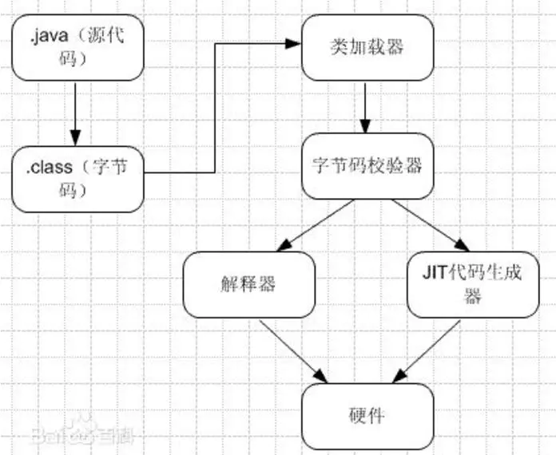

# 一、JVM原理

java编译器只要面向JVM，生成JVM能理解的字节码文件，Java源文件经过编译成字节码程序，通过JVM将每一条指令翻译成不同平台机器码，通过特定平台运行。
# 二、JVM运行时数据区

- 程序计数器是一个比较小的内存区域，用于指示当前线程所执行的字节码执行到了第几行，是线程私有的
- 虚拟机栈描述的是Java方法执行的内存模型，用于存储局部变量，操作数栈，动态链接，方法出口等信息，是线程私有的
- 堆是用来存储对象示例以及数组值的区域，堆中对象需要等待GC回收，是线程共享的
- 方法区在JVM中也是一个非常重要的区域，它与堆一样，是被 线程共享 的区域。 在方法区中，存储了每个类的信息（包括类的名称、方法信息、字段信息）、静态变量、常量以及编译器编译后的代码等。
- 运行时常量池 存放类的固定的常量信息、方法和Field的引用信息等，其空间从方法区中分配
- 本地方法栈 JVM采用本地方法堆栈来支持native方法的执行，此区域用于存储每个native方法调用的状态。
| --- | 作用 | 多线程 |
| --- | --- | --- |
| 程序计数器 | 用于指示当前线程所执行的字节码执行到了第几行 | 线程私有的 |
| 虚拟机栈 | JVM栈中存放的为当前线程中局部基本类型的变量（java中定义的八种基本类型：boolean、char、byte、short、int、long、float、double）、部分的返回结果以及Stack Frame，非基本类型的对象在JVM栈上仅存放一个指向堆上的地址 | 线程私有的 |
| 堆 | 存储对象示例以及数组值的区域 | 线程共享的 |
| 方法区 | 存储了每个类的信息（包括类的名称、方法信息、字段信息）、静态变量、常量以及编译器编译后的代码等 | 线程共享的 |
| 运行时常量池 | 存放类的固定的常量信息、方法和Field的引用信息等，其空间从方法区中分配 |  |
| 本地方法栈 | JVM采用本地方法堆栈来支持native方法的执行，此区域用于存储每个native方法调用的状态。 |  |

